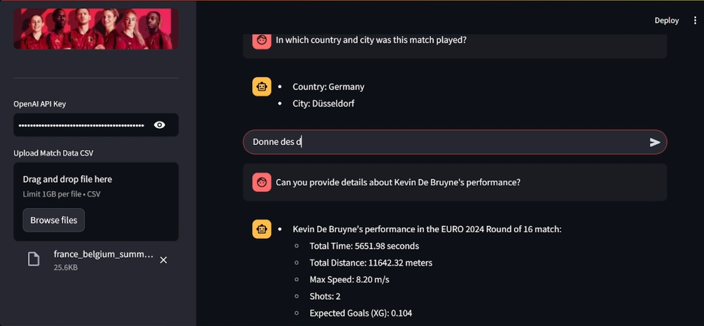
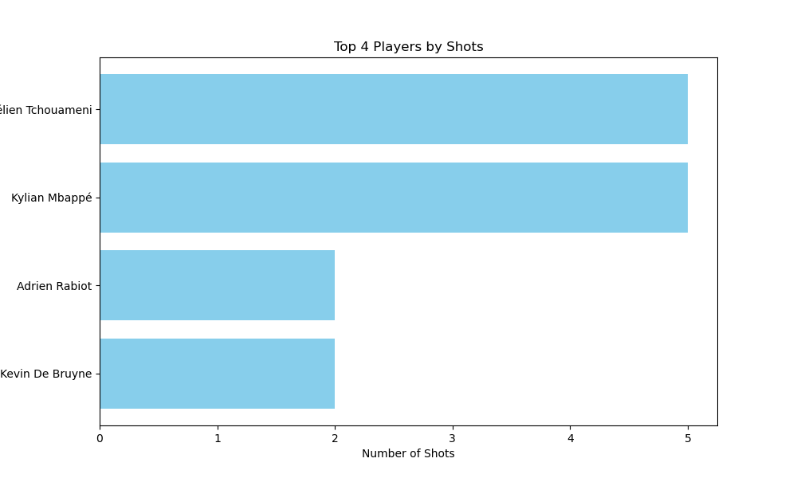

# Soccer Analytics AI - Data Analysis Assistant ⚽

## Introduction 🌟

Welcome to the **Football AI Chatbot** repository! This project combines data analysis, AI models, and visualization tools to help with football data analysis. It's designed for analysts, coaches, and anyone interested in football stats, even without coding experience.

### Why a Data Analysis Assistant? 🤔

Many professionals understand football tactics and statistics but lack the coding skills to analyze large datasets. This chatbot makes it easy to interact with your data and generate custom visualizations, without needing any coding knowledge.

The chatbot supports multiple languages 🌍 and processes your questions or requests against your dataset, returning insightful responses and visualizations 📊.

## Demo

Here are some examples of the capabilities of the **Soccer Analytics AI**:

1. **Data Analysis Example**:
    - Upload a CSV with football match data, and ask the assistant questions about the data. The assistant will provide structured responses and statistics based on the dataset.
    - 

2. **Data Visualization Example**:
    - The assistant can also generate visualizations based on your requests. Simply describe the type of chart or graph you want, and it will return the corresponding visualization.
    - 

## How to Use

### 1. Setup and Run the Environment

To use this project, you'll need to set up your environment by installing the required dependencies:

```bash
pip install -r requirements.txt
streamlit run main.py
```

### 2. Configure API Key

To use the chatbot feature, you'll need an OpenAI API key. If you don't have one already, you can sign up for an API key from OpenAI [here](https://platform.openai.com/api-keys).

### 3. Upload Football Data ⚽📊

Upload a CSV file with match data using the file uploader in the sidebar. The chatbot will analyze and process the data once uploaded.

### 4. Interact with the Chatbot 💬

Once your data is uploaded, you can interact with the chatbot. It will process the data and respond to questions like:

- "What is the average number of goals per match?"
- "Show me a chart of player performance over time."
- "Analyze the correlation between possession and goals."

You can also ask for custom visualizations based on the dataset. The assistant will generate a corresponding chart using Python libraries like Matplotlib or Seaborn.

### 5. Customize Responses and Visualizations 🎨

You can modify the response template and context for visualizations directly within the app. This feature allows you to tailor the assistant’s behavior according to your needs, making it adaptable to different scenarios.

### 6. View Results 📈

The assistant will return data-driven insights and, if requested, generate visualizations. You can download the charts and responses for your records.


